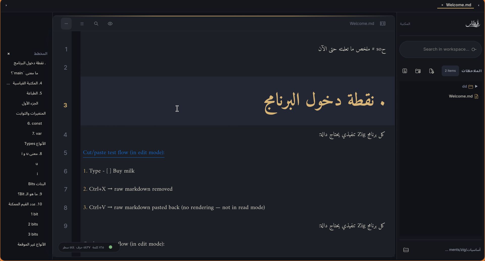
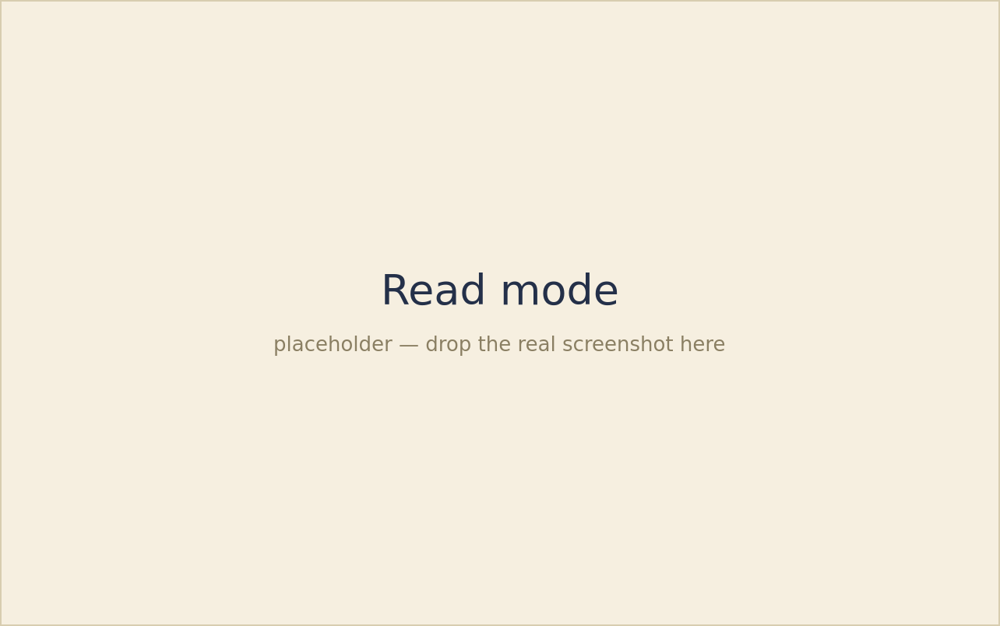
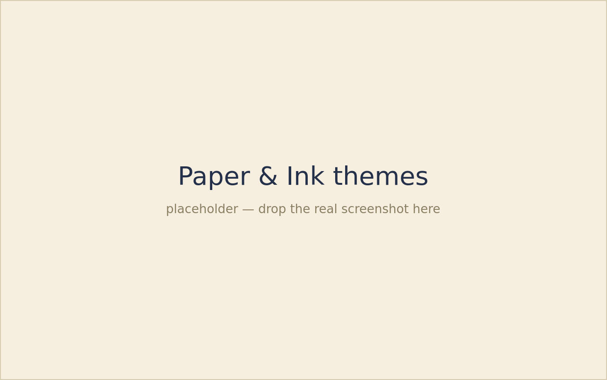
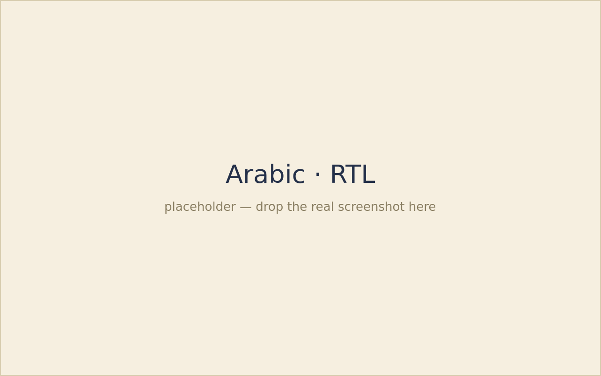

<div align="center">

<picture>
  <source media="(prefers-color-scheme: dark)" srcset="src/ui/icons/qirtas-logo-dark.png">
  
</picture>

# Qirtas · قِرطاس

A lightweight note editor for Linux that tries to remain just a note editor.

**English** · [العربية](README.md)

[](https://github.com/Ahmed-Sinkeat/Qirtas/releases/latest)

<sub>Zig core · GTK4 / Libadwaita · no Electron · no accounts · no AI inside the editor</sub>

</div>

---

## What is Qirtas?

A lightweight note editor focused on writing, reading, and organization.

Write your notes, save them as ordinary Markdown files, and take them wherever you want. 

If you want sync, use the service you trust. If you want backups, your files already belong to you. And if you decide to leave Qirtas tomorrow, you won't need to export your notes from a proprietary format or a closed platform.

## Screenshots

<div align="center">

|                  Editor                  |                    Reading Mode                   |
| :--------------------------------------: | :-----------------------------------------------: |
|  |  |
|          **Paper & Ink Themes**          |          **Arabic Right-to-Left Support**         |
|  |   |

</div>

## Installation

### AppImage — the easiest option, works on any distribution without installation

1. Download `Qirtas-x86_64.AppImage` from the [Releases](https://github.com/Ahmed-Sinkeat/Qirtas/releases) page.

2. Make it executable:

```sh
chmod +x Qirtas-x86_64.AppImage
```

3. Run it:

```sh
./Qirtas-x86_64.AppImage
```

No root privileges required, and nothing is copied into your system. (Requires FUSE, which is available on most Linux distributions.)

### Arch Linux

Build the package straight from the repo (no AUR account needed):

```sh
git clone https://github.com/Ahmed-Sinkeat/Qirtas.git
cd Qirtas/packaging
makepkg -si
```

Or install the prebuilt package from the [Releases](https://github.com/Ahmed-Sinkeat/Qirtas/releases) page:

```sh
sudo pacman -U qirtas-1.0.0-1-x86_64.pkg.tar.zst
```

> `yay -S qirtas-git` / `paru -S qirtas-git` will work once the package is published to the AUR.

### From Source

You'll need Zig 0.16, GTK4, Libadwaita, GtkSourceView 5, and SQLite. Install the dependencies for your distro:

```sh
# Arch
sudo pacman -S --needed zig gtk4 gtksourceview5 libadwaita sqlite

# Fedora
sudo dnf install zig gtk4-devel gtksourceview5-devel libadwaita-devel sqlite-devel

# Debian / Ubuntu (if the repo's Zig is older than 0.16, grab it from ziglang.org)
sudo apt install libgtk-4-dev libgtksourceview-5-dev libadwaita-1-dev libsqlite3-dev
```

Then build and run:

```sh
git clone https://github.com/Ahmed-Sinkeat/Qirtas.git
cd Qirtas
zig build run
```

Your notes and settings live in:

```text
~/.config/qirtas/
```

### Windows (experimental)

There is a Windows build, made with the MSYS2 MINGW64 toolchain. The easiest way
to get one without a local setup: every push runs the Windows CI workflow, which
builds and uploads a portable `qirtas-windows-x86_64` artifact. To build it
yourself, see **[docs/BUILDING-WINDOWS.md](docs/BUILDING-WINDOWS.md)**.

On Windows your notes and settings live under `%APPDATA%\qirtas` instead.

## Current State

Qirtas just reached its first release, v1.0.0. It is written and maintained by a single developer and used daily for real-world note taking.

It works, but expect a few rough edges.

Because your notes are ordinary `.md` files, the worst-case scenario is still just Markdown sitting safely on your disk.

Known issues are documented openly in [docs/ISSUES.md](docs/ISSUES.md).

## What iam planning to add

* Windows version — *builds now; see [docs/BUILDING-WINDOWS.md](docs/BUILDING-WINDOWS.md)*
* Better Arabic support
* Improvements to the writing experience
* Split view
* Better export and template support
* DOCX import and export
* spell checker
* Mobile version
* Plugin system

## What I Do Not Plan to Add to the Core

* Anything that does not directly improve writing, reading, or note organization.

## Contributing

Start by reading [docs/STRUCTURE.md](docs/STRUCTURE.md) — it explains how the project is organized and where everything lives (Zig owns the document state, while the C/GTK side renders it).

Then there is one question that should be asked before any feature:

> **Does this feature make Qirtas a better note-taking application?**
>
> If the answer is yes, it may belong in the project.
>
> If the answer is no, it should either be a separate plugin or not be added at all.

That question is what keeps a note-taking application focused on note-taking.

Please open an issue before large changes so we can evaluate them against that principle together.

---

<div align="center"><sub>GPL-3.0 · made for writing, not for platforms</sub></div>
